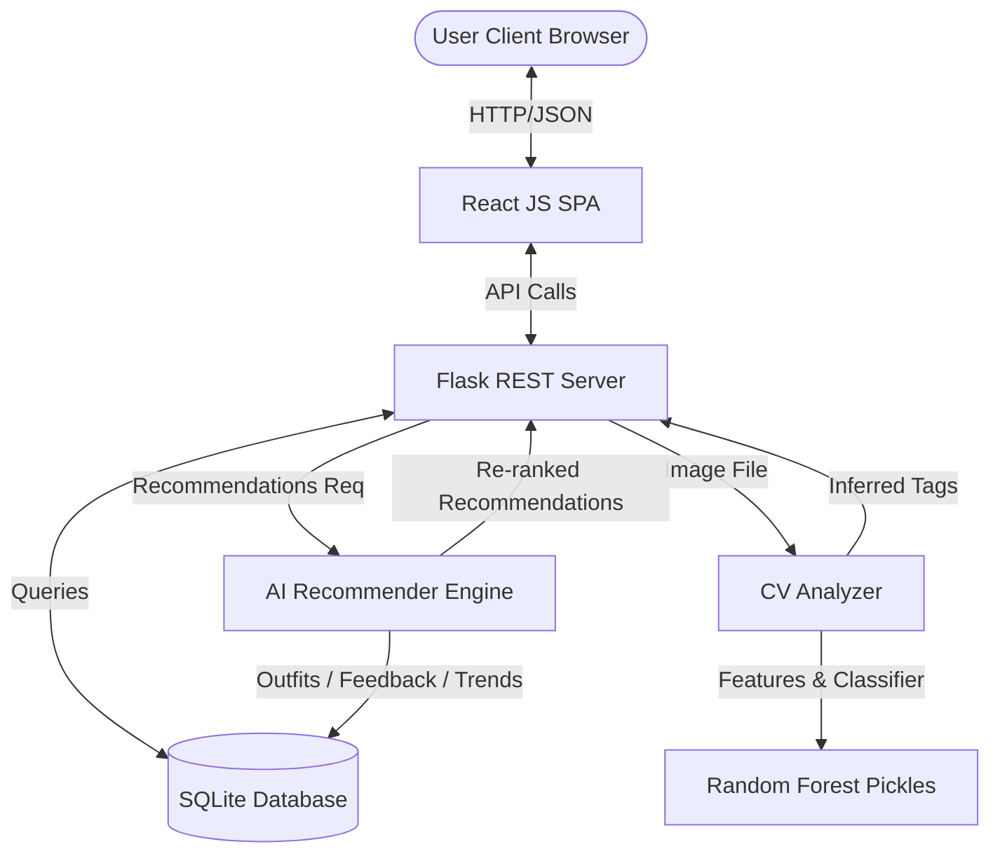
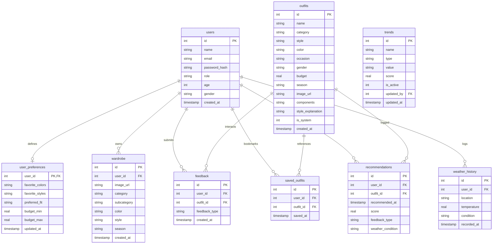

# Architecture and Entity Relationship Diagram — OptiFit 2.0

OptiFit 2.0 uses a modern micro-services design patterns consisting of a client dashboard (React), a prediction server (Flask REST API), and a content classifier pipeline.

---

## 🏛️ System Architecture Diagram

---

## 💾 Entity Relationship (ER) Diagram

